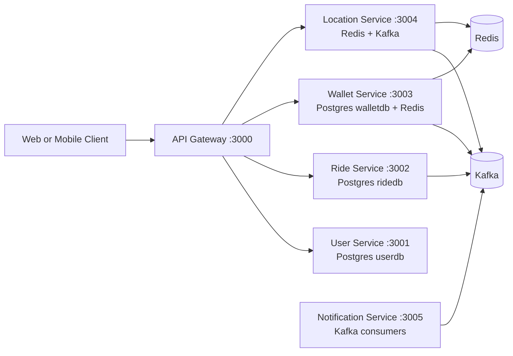
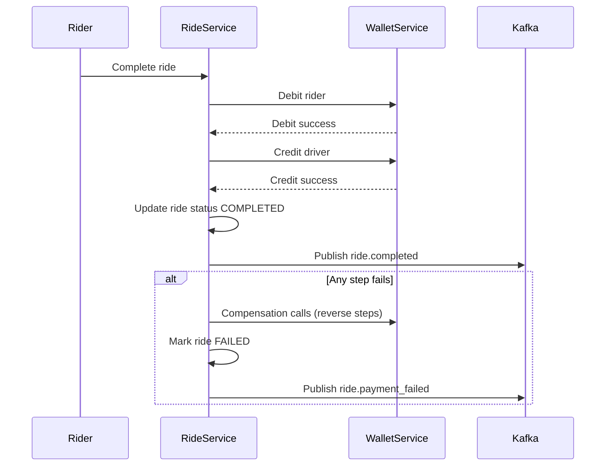
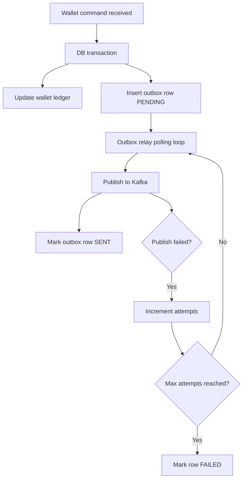

# UberPay

UberPay is a microservices-based backend for a ride-hailing and wallet payment platform.
It is built to explore production-style patterns such as:

- API Gateway routing
- JWT-based auth and role guards
- Saga orchestration for distributed transactions
- Outbox pattern for reliable event publishing
- Redis-backed locking and read optimization
- Kafka event-driven communication

## High-Level Architecture




## Service Map

| Service              | Port | Main Responsibility                                              | Data Store                 |
| -------------------- | ---: | ---------------------------------------------------------------- | -------------------------- |
| Gateway              | 3000 | Unified entrypoint, proxy/routing, middleware                    | None                       |
| User Service         | 3001 | Registration, login, JWT verification, profile management        | Postgres (userdb)          |
| Ride Service         | 3002 | Ride lifecycle, matching hooks, payment saga orchestration       | Postgres (ridedb)          |
| Wallet Service       | 3003 | Wallet balance and transactions, CQRS reads/writes, outbox relay | Postgres (walletdb), Redis |
| Location Service     | 3004 | Driver location and matching (scaffold present)                  | Redis, Kafka               |
| Notification Service | 3005 | Payment and ride notifications (scaffold present)                | Kafka consumers            |

## Current Status

Implemented and active:

- User Service
- Ride Service
- Wallet Service
- Infra stack (Kafka, Redis, Postgres x3, Kafka UI)

Scaffolded and partially wired:

- Gateway TypeScript structure (entry and route files currently placeholders)
- Location Service TypeScript structure
- Notification Service TypeScript structure
- Shared TypeScript package structure

## Core Flows

### 1) Ride Lifecycle and Payment Saga

When a driver completes a ride, the Ride Service runs a saga:

1. Debit rider wallet
2. Credit driver wallet (80 percent share)
3. Mark ride as COMPLETED
4. Publish ride.completed event

If any step fails, compensations run in reverse order and ride.payment_failed is emitted.



### 2) Wallet Outbox Reliability Flow

Wallet writes and outbox events are stored atomically in DB transactions.
A relay process publishes pending outbox records to Kafka and marks them SENT.



## API Overview

### User Service

Base path: /api/users

- POST /register
- POST /login
- POST /verify-token
- GET /me
- PATCH /me
- POST /change-password
- POST /driver/online
- GET /:id (internal)

### Ride Service

Base path: /api/rides

- GET /
- GET /:rideId
- POST / (request ride, rider role)
- POST /:rideId/match (internal)
- POST /:rideId/accept (driver role)
- POST /:rideId/start (driver role)
- POST /:rideId/complete (driver role)
- POST /:rideId/cancel

### Wallet Service

Base path: /api/wallet

- POST / (create wallet)
- GET / (wallet summary)
- GET /balance
- GET /balance/:userId (internal)
- GET /transactions
- GET /transactions/:userId (internal)
- POST /debit (saga/internal)
- POST /credit (saga/internal)
- POST /refund (saga/internal)
- POST /topup

## Kafka Topics in Use

Ride Service produces:

- ride.requested
- ride.matched
- ride.accepted
- ride.started
- ride.completed
- ride.cancelled
- ride.payment_failed

Wallet Service produces:

- payment.completed
- payment.failed
- payment.credit_applied
- payment.refund_processed

Wallet Service consumes:

- ride.completed

## Local Development

## Prerequisites

- Docker Desktop
- Node.js 18+
- npm

### 1) Install dependencies

From root and each service as needed:

```bash
npm install
```

### 2) Start full stack

```bash
npm run dev
```

Useful root scripts:

- npm run infra -> starts shared infra in background
- npm run stop -> stops all containers
- npm run logs -> follows compose logs

### 3) Service health checks

- User: http://localhost:3001/health
- Ride: http://localhost:3002/health
- Wallet: http://localhost:3003/health

### 4) Kafka UI

- http://localhost:8090

## Data and Infra

- postgres-user exposed at localhost:5433
- postgres-ride exposed at localhost:5434
- postgres-wallet exposed at localhost:5435
- redis exposed at localhost:6379
- kafka exposed at localhost:9092

## Security and Reliability Notes

- JWT auth middleware protects user-facing routes.
- Role checks are applied for rider vs driver operations.
- Login/register endpoints have rate limiting.
- Wallet operations are idempotent via reference-based command handling.
- Outbox pattern prevents lost events when process crashes after DB commit.
- Ride payment uses saga compensation for partial-failure recovery.

## Suggested Next Steps

- Implement Gateway proxy routes and middleware glue so clients use only :3000.
- Complete Location Service matching logic and socket updates.
- Complete Notification Service Kafka consumers for rider and driver updates.
- Add integration tests for ride completion plus saga rollback scenarios.
- Add dead-letter queue and alerting for failed outbox messages.

## Project Structure

```text
uberPay/
  gateway/
  infra/
    kafka/
    postgres/
  services/
    user-service/
    ride-service/
    wallet-service/
    location-service/
    notification-service/
  shared/
```

This repository is a strong foundation for experimenting with real-world distributed system patterns in a compact, local-first setup.
